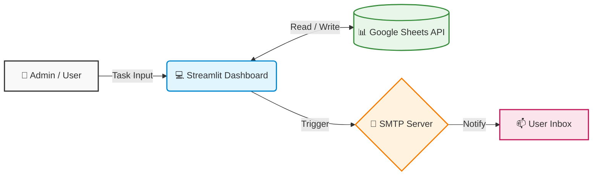
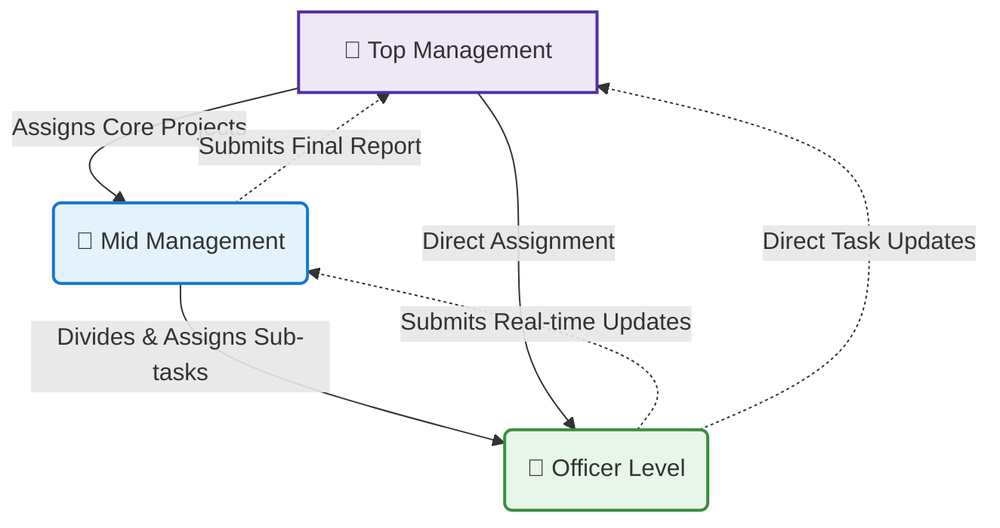

# Task-Management-Dashboard-Showcase
# 🚀 Centralized Task Management & Workflow Optimization System ( PATH Youth Forum )

A real-time, scalable task management dashboard engineered to streamline organizational operations, automate reporting, and enhance team accountability.

## 🎯 Problem Statement & Motivation
Upon taking charge as the **General Secretary of PATH Youth Forum**, I quickly identified a major operational bottleneck: task delegation and tracking were highly disorganized. 
* **Lack of Centralization:** Tasks were being assigned randomly via social media or verbal communication.
* **Low Accountability:** Deadlines were frequently missed due to the absence of a proper tracking mechanism.
* **Poor Work Efficiency:** Following up on tasks required manual effort, wasting valuable leadership time.

**The Motivation:** I needed an instant, cost-effective, and customized solution to bring operational efficiency to the organization. Existing tools were either too complex for the general members or lacked the specific hierarchical control I needed. Therefore, I decided to engineer a custom system tailored precisely to our organizational workflow.

---

## 💡 The Solution (Novelty)
I developed a lightweight yet robust web application using **Python and Streamlit**, functioning with **Google Sheets** as a dynamic, cloud-based database. 

Instead of overwhelming the team with complex features, I adopted an **MVP (Minimum Viable Product)** approach—focusing strictly on core functionalities (Assign, Track, Update) to ensure smooth user onboarding. The system ensures top-tier security by storing credentials securely using Streamlit Secrets and handling all database operations via Google Service Accounts.

---

## 🏗️ System Architecture

## 🎯 Project Objective
Designed to eliminate communication bottlenecks by replacing fragmented task tracking with a unified, cloud-connected platform. The system ensures real-time tracking, automated SMTP email alerts, and seamless status updates.

## ✨ Key Features
* **Automated SMTP Notifications:** Instant email dispatch for new task assignments and status updates.
* **Real-time Database Sync:** Direct integration with Google Sheets API for live data storage and retrieval.
* **Role-based Task Visualization:** Clean, filtered dashboards for individual assignees to view and update only their specific tasks.
* **Automated Time-stamping:** Accurate, system-generated tracking of submission times to prevent manual entry errors (Diagonal Data Bug resolved).
* **Automated Efficiency Tracking & Psychological Nudging:** Upon task completion, the system instantly cross-references the submission timestamp against the predefined deadline to determine if the task was completed on time or delayed (calculating the exact duration of the delay in hours). This real-time performance metric is prominently displayed on both the assigner's and the assignee's dashboards. Beyond serving as a crucial Key Performance Indicator (KPI) for measuring operational efficiency, this transparent feedback loop acts as a subtle psychological motivator, naturally nudging assignees to optimize their time management and consistently avoid delayed completions in future assignments.
* **Real-Time Status Tracking & Visual Progress Bars:** Assignees can seamlessly update their task stages (e.g., To-Do, In Progress, Review, Completed) through an intuitive interface. These updates instantly trigger dynamic visual progress bars on the dashboard, offering an immediate and clear visual representation of workflow advancement for both team members and management.
* **360° Organizational Visibility & Tracking:** Top Management is equipped with a bird's-eye view of all organizational activities. They can instantly monitor any active task across the system—regardless of who assigned it (other Top Management or Mid-Management)—and track its real-time progress stage, ensuring complete transparency.
* **Interactive Review & Approval Workflow:** Once an assignee marks a task as completed, it automatically routes back to the assigner's portal for evaluation. Managers can either approve the task to clear it from the dashboard or put it on "Hold" with specific feedback comments if revisions are required, ensuring strict quality control.
* **Dynamic Task Lifecycle Management & Lean Communication (JIT):** Assigners retain absolute control over a task's lifecycle even after delegation, with the ability to seamlessly modify deadlines, update resources, or completely cancel tasks directly from their dashboard. Any adjustment instantly triggers a comprehensive, automated Just-In-Time (JIT) email alert to the assignee detailing the exact changes. By delivering real-time updates exactly when needed, the system actively mitigates systemic communication gaps and eradicates the need for manual follow-ups or redundant messaging. This effectively eliminates "over-processing" (a core principle of Lean 7 Wastes), ensuring a highly efficient, lean, and continuous operational workflow.

### 🤝 Organizational Work Culture (Flexible Hierarchy)
Being a social organization, PYF promotes a collaborative, open, and dynamic work environment rather than a strictly rigid corporate hierarchy. 

While a standard chain of command exists for major core operations, **Top Management retains the flexibility to directly assign tasks to the Officer Level**. This ensures rapid execution, agile decision-making, and maintains a close-knit, highly engaged team culture.

## 🎬 System Previews & Features
*(Here is a quick overview of the core functionalities in action)*

<table align="center">
  <!-- প্রথম সারি: টাইটেল -->
  <tr>
    <td align="center"><b>1. Dynamic Language Toggle</b></td>
    <td align="center"><b>2. Login, Task Assignment & Email Alert</b></td>
  </tr>
  <!-- প্রথম সারি: GIF -->
  <tr>
    <td></td>
    <td></td>
  </tr>
  
  <!-- দ্বিতীয় সারি: টাইটেল (মাঝখানে থাকবে) -->
  <tr>
    <td align="center" colspan="2"><b>3. Task Status Update & Visual Progress Bar</b></td>
  </tr>
  <!-- দ্বিতীয় সারি: GIF (মাঝখানে থাকবে) -->
  <tr>
    <td align="center" colspan="2">
 width="400" alt="Progress Bar"/></td>
  </tr>
</table>

## 🎥 System Walkthrough (Demo)
*A short video demonstration showcasing the user interface, task assignment process, and email notification workflow.*
> 🔗 **[Click here to watch the Video Walkthrough (YouTube Unlisted)](#)** *(Replace this with your YouTube link)*

## 🛠️ Technology Stack
* **Frontend:** Streamlit (Python)
* **Backend/Database:** Google Sheets API (`gspread`, `oauth2client`)
* **Data Manipulation:** Pandas
* **Automation:** Python `smtplib`, `email.mime`
* **IDE:** Visual Studio Code

### 🚀 What's New in Version 1.1 (Localization & Accessibility)
* **Dynamic Language Toggle (English / Bengali):** Implemented a session-state-based translation dictionary allowing users to switch the entire interface between English and Bengali instantly.
* **Inclusive User Experience:** Designed to break language barriers, ensuring users comfortable in their native language can operate the system flawlessly alongside those preferring English.
* **Scalable Architecture:** The translation logic is entirely decoupled from the core codebase, making it highly flexible to add more regional languages in the future with zero downtime.

### 🛡️ What's New in Version 1.2 (Security & Authentication Upgrade)
* **Cryptographic Password Hashing:** Upgraded from plaintext database storage to secure password hashing using `Werkzeug` to prevent data breaches.
* **Secure Session Management:** Replaced vulnerable plaintext cookies with encrypted JSON Web Tokens (JWT) for the auto-login feature, effectively eliminating session hijacking risks.
* **Cross-Site Scripting (XSS) Protection:** Implemented strict HTML escaping and URL validation across all user inputs and dynamic table rendering to prevent malicious script injections.

  
## 🚀 Future Scope: Process Optimization Roadmap (Version 2.0)
As an engineer focused on systems optimization, I deliberately refrained from front-loading the system with heavy, complex features (such as gamified leaderboards) to prevent user fatigue. The current architecture is live specifically to gather **User Experience (UX) data and real-time behavioral metrics**. 

Based on the upcoming operational insights, the following data-driven optimizations are slated for Version 2.0:

### 🧠 Intelligent Workflow & Automation
* **⚖️ Workload Balancing Alerts:** An automated pre-assignment check that alerts managers if a team member is currently overloaded with pending tasks, proactively preventing resource bottlenecks and employee burnout.
* **⏰ Smart Reminder System (JIT Follow-ups):** Automated email triggers and dashboard nudges for tasks approaching their 24-hour deadline window to ensure continuous operational flow.

### 📊 Data-Driven Analytics
* **📈 Process Analytics Dashboard:** Integration of a dedicated graphical visualization panel for administration. This will utilize analytical charts to track project velocity, measure task efficiency rates, and identify persistent organizational bottlenecks.

### 📋 UI/UX Enhancements
* **🗂️ Kanban Board Visualization:** Upgrading the standard tabular UI to an interactive, industrial Kanban flow (To-Do ➔ In-Progress ➔ Done) for enhanced visual project management and status tracking.

### ⚙️ System Architecture & Performance
* **⚡ API & Load Optimization:** Implementation of memory caching (`@st.cache_data`) for repetitive queries to drastically reduce Google Sheets API calls, optimize request handling, and enhance overall system speed.

---
*Developed with 💡 by **Ashfaqur Rahman** | Focused on Operations, Systems Engineering & Process Optimization.*

