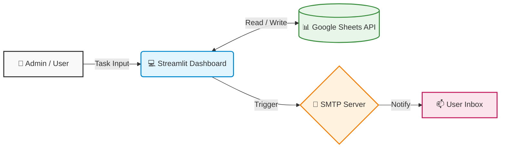
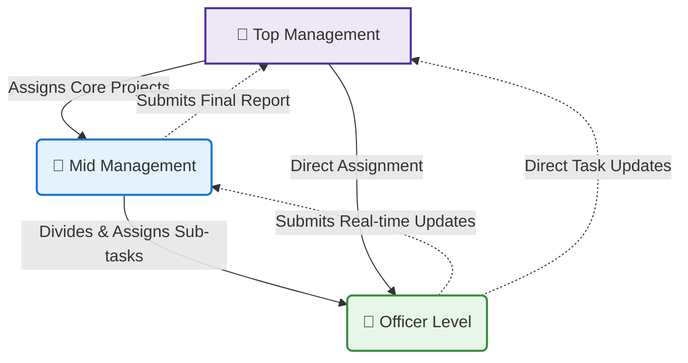

# Task-Management-Dashboard-Showcase
# 🚀 Centralized Task Management & Workflow Optimization System (PYF)

A real-time, scalable task management dashboard engineered to streamline organizational operations, automate reporting, and enhance team accountability. 

## 🏗️ System Architecture

## 🎯 Project Objective
Designed to eliminate communication bottlenecks by replacing fragmented task tracking with a unified, cloud-connected platform. The system ensures real-time tracking, automated SMTP email alerts, and seamless status updates.

## ✨ Key Features
* **Automated SMTP Notifications:** Instant email dispatch for new task assignments and status updates.
* **Real-time Database Sync:** Direct integration with Google Sheets API for live data storage and retrieval.
* **Role-based Task Visualization:** Clean, filtered dashboards for individual assignees to view and update only their specific tasks.
* **Automated Time-stamping:** Accurate, system-generated tracking of submission times to prevent manual entry errors (Diagonal Data Bug resolved).
* **360° Organizational Visibility & Tracking:** Top Management is equipped with a bird's-eye view of all organizational activities. They can instantly monitor any active task across the system—regardless of who assigned it (other Top Management or Mid-Management)—and track its real-time progress stage, ensuring complete transparency.

### 🚀 What's New in Version 1.1 (Localization & Accessibility)
* **Dynamic Language Toggle (English / Bengali):** Implemented a session-state-based translation dictionary allowing users to switch the entire interface between English and Bengali instantly.
* **Inclusive User Experience:** Designed to break language barriers, ensuring users comfortable in their native language can operate the system flawlessly alongside those preferring English.
* **Scalable Architecture:** The translation logic is entirely decoupled from the core codebase, making it highly flexible to add more regional languages in the future with zero downtime.

### 🛡️ What's New in Version 1.2 (Security & Authentication Upgrade)
* **Cryptographic Password Hashing:** Upgraded from plaintext database storage to secure password hashing using `Werkzeug` to prevent data breaches.
* **Secure Session Management:** Replaced vulnerable plaintext cookies with encrypted JSON Web Tokens (JWT) for the auto-login feature, effectively eliminating session hijacking risks.
* **Cross-Site Scripting (XSS) Protection:** Implemented strict HTML escaping and URL validation across all user inputs and dynamic table rendering to prevent malicious script injections.

### 🤝 Organizational Work Culture (Flexible Hierarchy)
Being a social organization, PYF promotes a collaborative, open, and dynamic work environment rather than a strictly rigid corporate hierarchy. 

While a standard chain of command exists for major core operations, **Top Management retains the flexibility to directly assign tasks to the Officer Level**. This ensures rapid execution, agile decision-making, and maintains a close-knit, highly engaged team culture.

## 🛠️ Technology Stack
* **Frontend:** Streamlit (Python)
* **Backend/Database:** Google Sheets API (`gspread`, `oauth2client`)
* **Data Manipulation:** Pandas
* **Automation:** Python `smtplib`, `email.mime`
* **IDE:** Visual Studio Code

## 📈 Future Roadmap (Version 2.0)
* Integration of analytical charts for performance tracking.
* Implementation of memory caching (`@st.cache_data`) for optimized API request handling.

